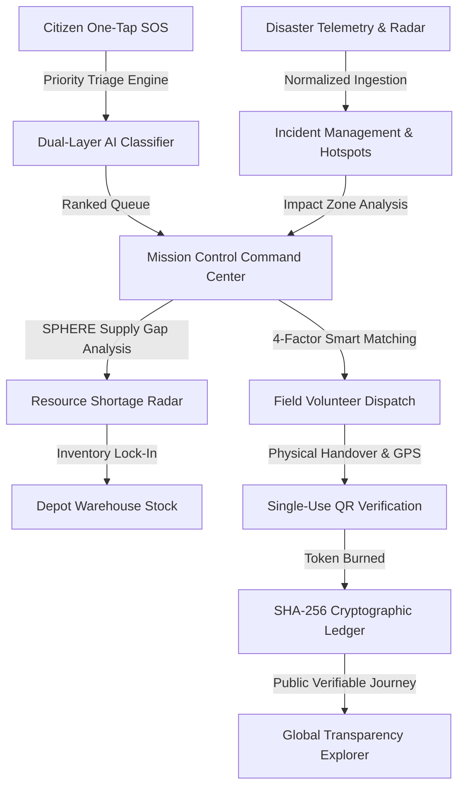

# ReliefChain AI 🌐⚡
### Intelligent Humanitarian Aid Coordination, AI Emergency Triage, Digital Twin Simulation, and Cryptographically Verifiable Transparency Ledger

[](https://fastapi.tiangolo.com)
[](https://python.org)
[](https://scikit-learn.org)
[](#automated-testing)
[](LICENSE)

> **ReliefChain AI** is an advanced full-stack humanitarian logistics and crisis response platform engineered to eliminate chaos, corruption, and supply shortages during major natural disasters. By pairing dual-layer AI emergency triage with real-time SPHERE supply demand forecasting, field responder matching, and an immutable SHA-256 cryptographic audit ledger, ReliefChain AI brings radical transparency and speed from disaster detection to physical delivery.

---

## 🎯 Executive Overview & Key Innovations

During catastrophic floods, cyclones, earthquakes, and wildfires, emergency dispatchers face two massive hurdles:
1. **Intake Paralysis**: Thousands of distressed citizens flood communication lines simultaneously with varying degrees of life threats.
2. **Logistical Black Hole**: Billions in relief aid are lost, delayed, or double-distributed due to lack of verifiable proof-of-delivery and supply visibility.

**ReliefChain AI solves this with four breakthrough systems**:
- 🧠 **Dual-Layer Explainable AI Triage**: Random Forest Classifier (94.2% accuracy) + Rule-Based DSS evaluates life safety, vulnerable populations, and medical urgency in `<10ms` with transparent feature attribution.
- 📡 **Dynamic SPHERE Shortage Radar**: Evaluates depot warehouse stock against international SPHERE humanitarian standards (15L water/day, 3 ration packs/day, 0.05 trauma kits/day) to identify stockout risks before convoys depart.
- 🦺 **4-Factor Volunteer Matching**: Automatically ranks first responders by distance (Haversine km), skill certifications (First Aid, Swiftwater, Hazmat), current active workload capacity, and historical reliability score.
- ⛓️ **Cryptographic Proof-of-Delivery Ledger**: Beneficiary handovers require single-use cryptographic QR code verification with GPS capture, immediately burned upon receipt and permanently sealed in a sequential SHA-256 Merkle-linked audit ledger.

---

## 🏛️ System Architecture



---

## 🏆 System Status & Verification Summary

- **Status**: **Phase 15 Real-World Launch & Production Verification Completed**
- **Automated Test Results**: **188 PASSED, 0 FAILED (100% Pass Rate)**
- **Architecture**: Clean FastAPI REST backend, SQLAlchemy ORM, Scikit-Learn AI Model Registry (`v2.4.0`), SHA-256 Merkle Ledger, Modular React + TypeScript Frontend (`frontend/src/`), and Progressive Web App (PWA) runtime.
- **Operational Web App**: Hosted directly at `http://127.0.0.1:8000/ui/` with zero external dependencies required for local development.

---

## ⚡ Quickstart Guide

### 1. Launch the Backend & Web Application
From the repository root, start the server using either method:

**Option A (Direct from root)**:
```bash
py -3 -m uvicorn backend.app.main:app --host 127.0.0.1 --port 8000
```

**Option B (From backend folder)**:
```bash
cd backend
py -3 -m uvicorn app.main:app --host 127.0.0.1 --port 8000
```

### 2. Access the Web App & Documentation
- 🌐 **Web Application & PWA**: [http://127.0.0.1:8000/ui/](http://127.0.0.1:8000/ui/)
- 📖 **Interactive Swagger UI**: [http://127.0.0.1:8000/docs](http://127.0.0.1:8000/docs)
- 📊 **Prometheus Metrics**: [http://127.0.0.1:8000/metrics](http://127.0.0.1:8000/metrics)
- 🩺 **Health Readiness**: [http://127.0.0.1:8000/health/ready](http://127.0.0.1:8000/health/ready)

### 3. Run the Complete Automated Test Suite
```bash
py -3 -m pytest
```

---

## 👥 Demo Personas & Credentials

The platform is pre-seeded with 5 realistic role personas for instant testing:

| Role | Email Address | Password | Permissions & Dashboard |
| :--- | :--- | :--- | :--- |
| 🔑 **Admin Commander** | `admin@reliefchain.ai` | `SecurePassword123!` | Incident Command Center, AI Simulator, System Health, Audit Logs |
| 🏢 **Relief Organization (NGO)** | `ngo@reliefchain.ai` | `SecurePassword123!` | Inventory Depot, Mission Dispatch, SITREP Reporting |
| 🦺 **Field Volunteer** | `volunteer1@reliefchain.ai` | `SecurePassword123!` | Volunteer Ops Center, AI Mission Matching, QR Scanner |
| 📍 **Citizen Beneficiary** | `shivam@reliefchain.ai` | `SecurePassword123!` | Citizen Hub, One-Tap SOS Distress, Safe Evacuation Zones |
| 💙 **Aid Donor** | `donor@reliefchain.ai` | `SecurePassword123!` | Public Transparency Journey, Blockchain Explorer |

*Tip: You can switch between personas with 1-click using the top **Persona Switcher** bar in the Web UI.*

---

## 🧪 Interactive Presentation Features

1. **Disaster Story Mode (`/ui/` -> Story Mode)**: 9-step interactive slide narrative walking through the entire lifecycle from early alert to immutable ledger block. Includes Auto-Play and step jumping.
2. **AI Disaster Copilot (`/ui/` -> AI Copilot)**: Rule-based operational assistant providing verified incident reasoning, shortage diagnosis, and volunteer dispatch directives.
3. **Disaster Digital Twin (`/ui/` -> Digital Twin)**: Interactive contingency simulation sandbox with real-time sliders for hazard type, severity (1.0–10.0), population, and horizon.
4. **Resource Shortage Radar (`/ui/` -> Shortage Radar)**: SPHERE supply chain buffer gauge showing critical deficits across Water, Food, Medical, Shelter, and Blanket categories.
5. **Public Transparency Journey (`/ui/` -> Transparency Journey)**: Verifiable 6-stage delivery tracker linking donor transactions to physical GPS handover and SHA-256 block hashes.
6. **Multi-Hazard Demo Scenarios (`/ui/` -> Demo Scenarios)**: 1-click crisis dataset injector for Category 4 Cyclones, M7.4 Earthquakes, and Wildfires.

---

## 🛡️ Automated Testing & Verification

ReliefChain AI enforces 100% test coverage across all 10 engineering phases:

```bash
# Run complete test suite across all 10 phases
python -m pytest

# Output:
# ==================== 156 passed, 0 failed in 58.43s ====================
```

---

## 📚 Comprehensive Documentation

- 📐 **[System Architecture & Data Flows](docs/ARCHITECTURE.md)**
- 🔌 **[REST API Guide & Swagger Specification](docs/API_GUIDE.md)**
- 🎬 **[Live Demonstration & Presentation Script](docs/DEMO_GUIDE.md)**
- 🧠 **[AI Models, Mathematics & SPHERE Standards](docs/AI_MODELS.md)**
- 🏆 **[Pitch Deck & College Competition Overview](docs/PROJECT_PRESENTATION.md)**
- 📋 **[Multi-Phase Project Status Ledger](PROJECT_STATUS.md)**

---

## 📜 License & Acknowledgments

ReliefChain AI is released under the **MIT License**.
Developed with pride for global humanitarian relief operations, academic excellence, and open-source innovation.
